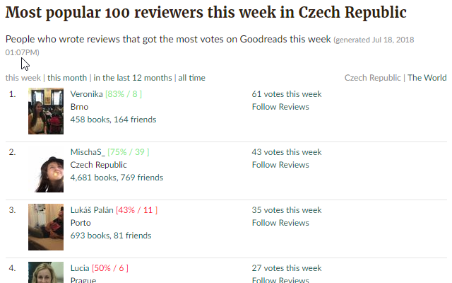
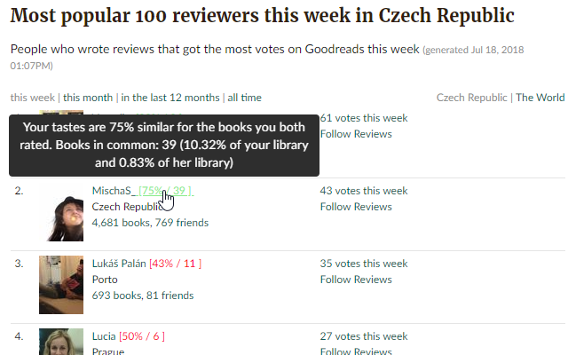

# Goodreads Compare Books Chrome extension
Chrome extension adding info about similarity of user's tastes.

Every time there is some username on the page this extension will add two numbers in brackets right next to it.

This way you can instantly see how similar is your book taste with that user (percentage of rating similarity from common books) and how many books you have in common.

If you hover over those number tooltip will show up with more detailed information about those two numbers.

That way you don't get lost in that many numbers.

## Developer notes

Note that this is my first extension and so far it had not been tested much. It is meant to be a draft to see if people are interested and what features would be most beneficial.

As this is a draft, every aspect of this extension is subject of change. Please create issue if you have any problems or suggestions.

For the same reason (being a draft) there is no configuration at all. This is planned, but I need to see some feedback first.
